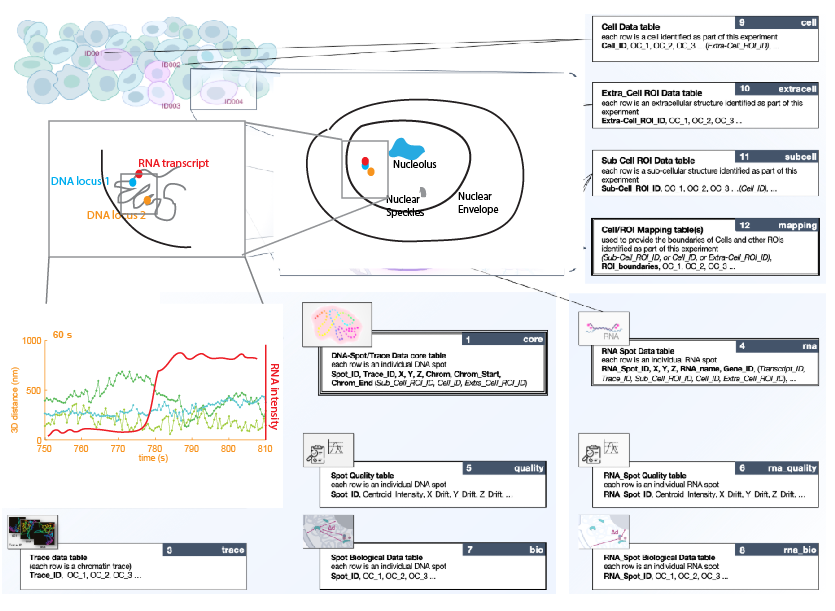

## 4DN SPT Format - Single Particle Tracking (DRAFT version: In Progress)

This document describes the **4DN SPT format for Single Particle Tracking**, a community data format designed for capturing and exchanging the results of SPT experiments produced within the context of the 4D Nucleome (4DN) project.

The image below gives a schematic view of the SPT tables

